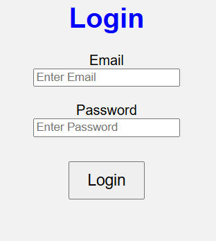
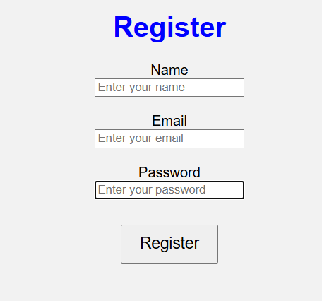
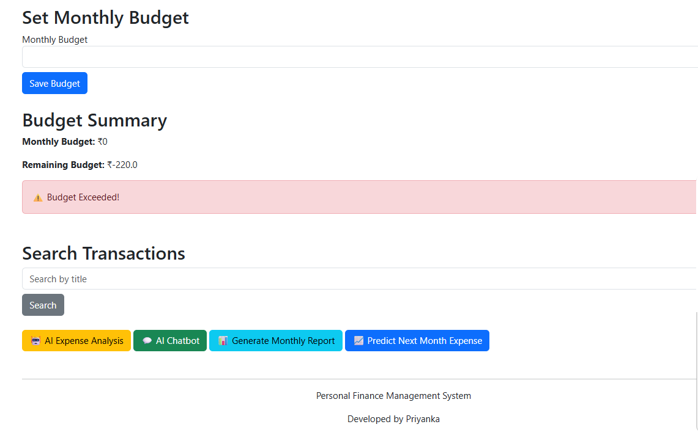
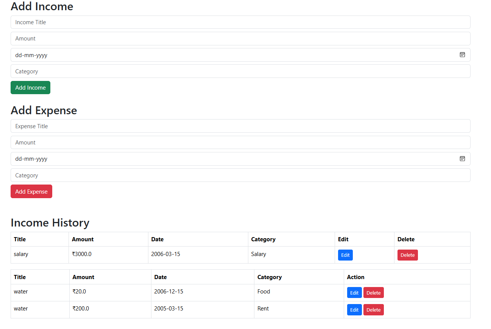

# Personal Finance Management System

## Technologies Used
- Python
- Flask
- MySQL
- HTML
- CSS
- JavaScript
- Bootstrap

## Features
- User Registration
- User Login
- Add Income
- Add Expense
- Financial Dashboard
- Categories
- Charts
- Budget Management
- Search Transactions

## How to Run

pip install -r requirements.txt

python app.py

## 📸 Screenshots

### login

### register

### AI Expense Analysis

### Income and Expense

